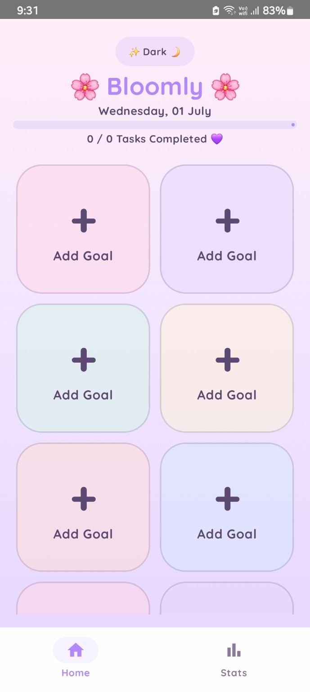
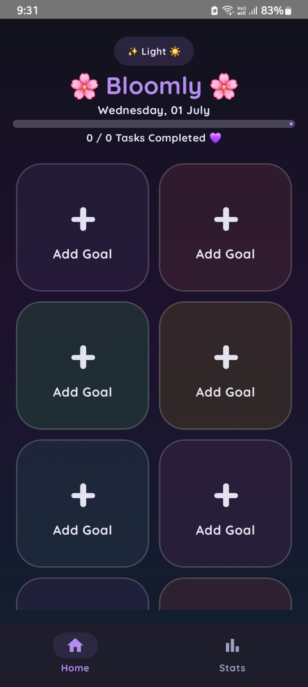
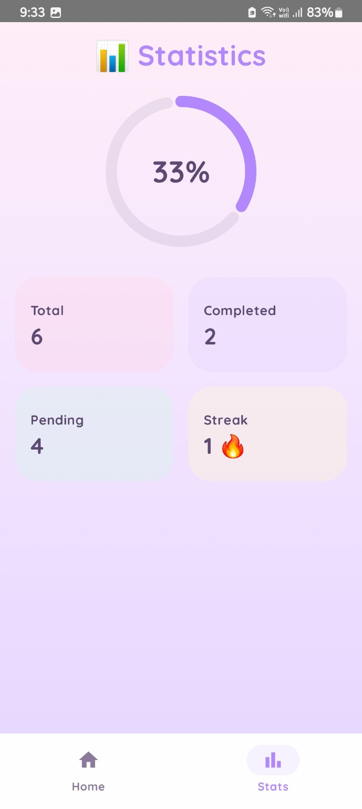
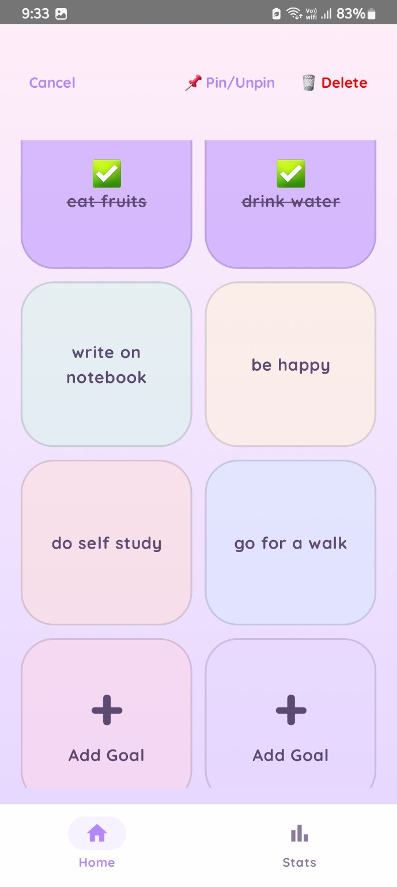
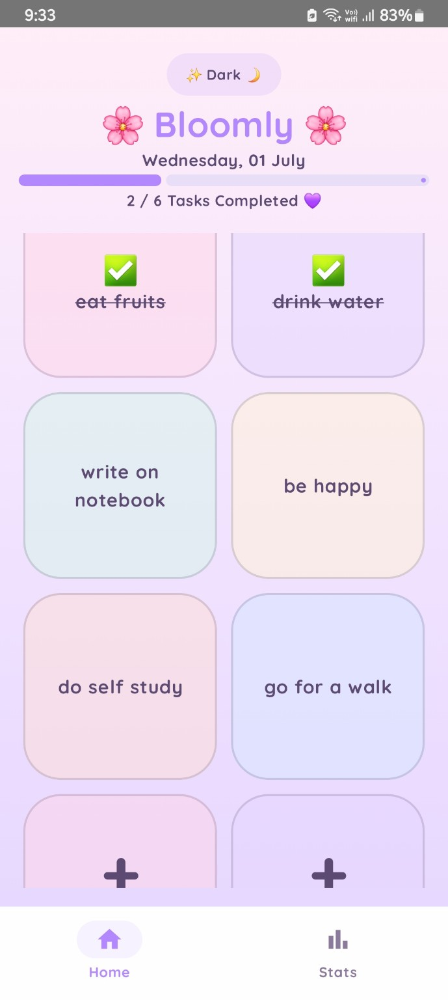

# 🌸 Bloomly

> **Designed to help your goals bloom through elegant task management.**

Bloomly is a beautifully designed productivity app built with **Kotlin** and **Jetpack Compose**, combining a soft pastel aesthetic with practical task management features. It focuses on making productivity enjoyable through a clean, modern, and responsive user experience.

---


## ✨ Features

- 🌸 Beautiful pastel-inspired UI
- 🌙 Light & Dark Mode
- 📝 Add, Edit & Delete Tasks
- ✅ Mark tasks as Complete
- 📊 Live Progress Tracking
- 📈 Statistics Dashboard
- 💾 Persistent Data using DataStore
- 📅 Current Date Display
- 📌 Pin / Unpin Important Tasks
- 🔥 Daily Streak Counter
- 🎨 Custom Quicksand Typography
- ⚡ Smooth Animations
- 📱 Built entirely with Jetpack Compose

---
## 🌸 How to Use

Using Bloomly is simple and intuitive:

| Gesture | Action |
|---------|--------|
| 👆 Single Tap | Mark a task as complete or incomplete |
| ✏️ Double Tap | Edit an existing task |
| 🗑️ Long Press | Delete a task |
| 📌 Pin Button | Pin or unpin important tasks |
| 🌙 Theme Toggle | Switch between Light and Dark Mode |
| 📊 Statistics | View your productivity dashboard |

---

### 💡 Quick Start

1. Tap an empty card to create a new task.
2. Enter your goal and save it.
3. Tap a task once to mark it as completed.
4. Double tap to edit the task.
5. Long press to delete it.
6. Track your progress using the progress bar and statistics page.
7. Your tasks are automatically saved using DataStore, so they remain even after closing the app.

## 🌷 Why Bloomly?

Bloomly was created with the idea that productivity apps should feel calm, elegant, and enjoyable to use.

Instead of focusing only on functionality, Bloomly combines a soft pastel aesthetic with modern Android development practices to create an experience that motivates users to stay organized.

The project also served as a hands-on journey to learn Jetpack Compose, Material 3, DataStore, animations, and modern Android UI development.

## 🛠 Tech Stack

- Kotlin
- Jetpack Compose
- Material 3
- Android DataStore
- Navigation Compose
- State Management
- Android Studio

---

## 📱 Screenshots

### 🌸 Light Mode



---

### 🌙 Dark Mode



---

### 📊 Statistics



---

### 📌 Pin Mode and Deletion



---

### 📝 Task Management



## 🚀 Getting Started

Clone the repository

```bash
git clone https://github.com/Simranroshangupta/Bloomly.git
```

Open the project in Android Studio and run it on an Android device or emulator.

---

## 👩‍💻 Developer

**Simran Gupta**

GitHub: https://github.com/Simranroshangupta

---

## ⭐ Support

If you like this project, consider giving it a ⭐ on GitHub.
